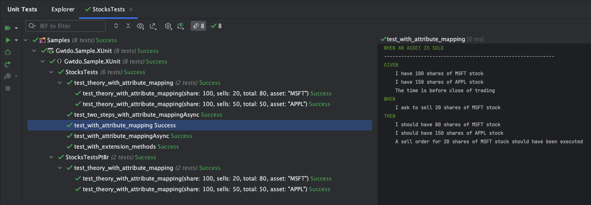
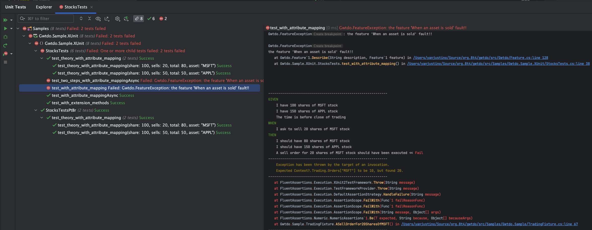
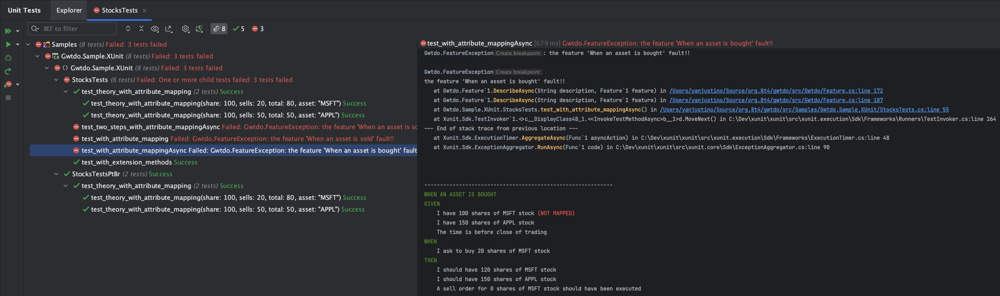

<p align='center'>
    
    <br/>
    <br/>
    <a href='https://github.com/8T4/gwtdo/actions/workflows/dotnet.yml'></a>
    <a href='https://github.com/8T4/gwtdo/actions/workflows/codeql-analysis.yml'></a>
    <a href='https://www.nuget.org/packages/Gwtdo'></a>
    <a href='https://www.nuget.org/packages/Gwtdo'></a>
    <a href='https://www.codacy.com/gh/8T4/gwtdo/dashboard?utm_source=github.com&amp;utm_medium=referral&amp;utm_content=8T4/gwtdo&amp;utm_campaign=Badge_Grade'></a>
</p>


# Using the GWTDO Library
Given-When-Then (GWT) is a format for writing executable specifications or automated acceptance tests in Behavior Driven Development (BDD). GWT is a way of structuring test scenarios that makes them easy to read and understand by all stakeholders including developers, QA engineers, and business analysts. 
The Given-When-Then structure helps to ensure that the requirements of the system or feature being developed are clearly defined and that everyone involved in the development process has a shared understanding of what is expected.

## What is GWTDO?
Overall, GWTDO defines a BDD-style test suite, with a clear separation of concerns between the test scenario definition and the implementation details.

## How to use GWTDO?
To use a GWTDO library, you need to follow these steps:

1. Add the library to your project: You can either download the library and add it as a reference to your project or use NuGet, a package manager for .NET, to install the library.
2. Import the library: In your code, you need to import the library namespace to access its classes, methods, and properties. You can do this by using the using statement in C#.
3. Use the library: Once you have imported the library, you can use its classes, methods, and properties in your code.

## Example
In this example, we will use the XUnit framework. The domain classes, as well as the code used below, can be accessed [here](src/Samples).

### 1. Specification
This is a BDD-style scenario for a feature named "User trades stocks". The scenario describes the behavior of the system when a user requests to sell a certain number of shares of a particular stock before the close of trading.

```sql
Feature: User trades stocks
  Scenario: User requests a sell before close of trading
    Given I have 100 shares of MSFT stock
       And I have 150 shares of APPL stock
       And the time is before close of trading

    When I ask to sell 20 shares of MSFT stock
     
     Then I should have 80 shares of MSFT stock
      And I should have 150 shares of APPL stock
      And a sell order for 20 shares of MSFT stock should have been executed
```

The scenario starts with some preconditions, which are specified using the "Given" keyword. In this case, the preconditions are that the user has 100 shares of MSFT stock and 150 shares of APPL stock, and that the time is before the close of trading. The next step in the scenario is to perform an action using the "When" keyword. In this case, the action is that the user requests to sell 20 shares of MSFT stock. 
Finally, the expected outcome of the action is specified using the "Then" keyword. In this case, the expected outcomes are that the user should have 80 shares of MSFT stock and 150 shares of APPL stock, and that a sell order for 20 shares of MSFT stock should have been executed. The scenario provides a clear description of the intended behavior of the system for this specific use case, and can serve as a basis for designing, testing and implementing the necessary features in a BDD-oriented development process.

### 2. BDD-style scenario using GWTDO
This code demonstrates how GWTDO can be used to write BDD-style tests that are readable and understandable by both technical and non-technical stakeholders.

```c#
public class StocksTests : Feature<TradingContext, TradingFixture>, IClassFixture<TradingContext>
{                                                                                                
    public StocksTests(ITestOutputHelper output, TradingContext context) : base(context)         
    {                                                                                            
        SetOutputRedirect(new TestOutputRedirect(output));                                       
    }   
    
    [Fact]
    [Scenario(@"User requests a sell before close of trading")]
    public void test_with_attribute_mapping()
    {
        Describe("When an asset is sold",
            GIVEN
            | "I have 100 shares of MSFT stock" | AND
            | "I have 150 shares of APPL stock" | AND
            | "The time is before close of trading" |
            WHEN
            | "I ask to sell 20 shares of MSFT stock" |
            THEN
            | "I should have 80 shares of MSFT stock" | AND
            | "I should have 150 shares of APPL stock" | AND
            | "A sell order for 20 shares of MSFT stock should have been executed");
    }
}                                                                                             

```
Overall, this code demonstrates how GWTDO can be used to write BDD-style tests that are readable and understandable by both technical and non-technical stakeholders.

The Feature class takes two generic parameters: the [TradingContext](src/Samples/Gwtdo.Sample/TradingContext.cs) and [TradingFixture](src/Samples/Gwtdo.Sample/TradingFixture.cs) classes. In addition, the StocksTests class implements the IClassFixture interface with TradingContext as the generic parameter. This allows the TradingContext to be injected into the test class.

The constructor of StocksTests takes an ITestOutputHelper and a TradingContext object as parameters. It calls the base constructor of Feature with the TradingContext object, and sets up a test output redirect using the ITestOutputHelper object.

The test_with_attribute_mapping() method is a test method with an XUnit attribute [Fact]. The test method uses the Scenario attribute to provide a description of the scenario being tested. The GIVEN, WHEN, and THEN keywords are used to describe the steps of the scenario in a readable format.

# Using the GWTDO Library
Given-When-Then (GWT) is a format for writing executable specifications or automated acceptance tests in Behavior Driven Development (BDD). GWT is a way of structuring test scenarios that makes them easy to read and understand by all stakeholders including developers, QA engineers, and business analysts.
The Given-When-Then structure helps to ensure that the requirements of the system or feature being developed are clearly defined and that everyone involved in the development process has a shared understanding of what is expected.

## What is GWTDO?
It´s a dotnet library that helps developers write readable tests. Also, it's a DSL based on the <strong>Given-When-Then</strong> style which could be used in your test projects

## How to use GWTDO?
To use a GWTDO library, you need to follow these steps:

1. Add the library to your project: You can either download the library and add it as a reference to your project or use NuGet, a package manager for .NET, to install the library.
2. Import the library: In your code, you need to import the library namespace to access its classes, methods, and properties. You can do this by using the using statement in C#.
3. Use the library: Once you have imported the library, you can use its classes, methods, and properties in your code.

## Example
In this example, we will use the XUnit framework. The domain classes, as well as the code used below, can be accessed [here](src/Samples).

### 1. Specification
This is a BDD-style scenario for a feature named "User trades stocks". The scenario describes the behavior of the system when a user requests to sell a certain number of shares of a particular stock before the close of trading.

```sql
Feature: User trades stocks
  Scenario: User requests a sell before close of trading
    Given I have 100 shares of MSFT stock
       And I have 150 shares of APPL stock
       And the time is before close of trading

    When I ask to sell 20 shares of MSFT stock
     
     Then I should have 80 shares of MSFT stock
      And I should have 150 shares of APPL stock
      And a sell order for 20 shares of MSFT stock should have been executed
```

The scenario starts with some preconditions, which are specified using the "Given" keyword. In this case, the preconditions are that the user has 100 shares of MSFT stock and 150 shares of APPL stock, and that the time is before the close of trading. The next step in the scenario is to perform an action using the "When" keyword. In this case, the action is that the user requests to sell 20 shares of MSFT stock.
Finally, the expected outcome of the action is specified using the "Then" keyword. In this case, the expected outcomes are that the user should have 80 shares of MSFT stock and 150 shares of APPL stock, and that a sell order for 20 shares of MSFT stock should have been executed. The scenario provides a clear description of the intended behavior of the system for this specific use case, and can serve as a basis for designing, testing and implementing the necessary features in a BDD-oriented development process.

### 2. BDD-style scenario
This code demonstrates how GWTDO can be used to write BDD-style tests that are readable and understandable by both technical and non-technical stakeholders.

```c#
public class StocksTests : Feature<TradingContext, TradingFixture>, IClassFixture<TradingContext>
{                                                                                                
    public StocksTests(ITestOutputHelper output, TradingContext context) : base(context)         
    {                                                                                            
        SetOutputRedirect(new TestOutputRedirect(output));                                       
    }   
    
    [Fact]
    [Scenario(@"User requests a sell before close of trading")]
    public void test_with_attribute_mapping()
    {
        Describe("When an asset is sold",
            GIVEN
            | "I have 100 shares of MSFT stock" | AND
            | "I have 150 shares of APPL stock" | AND
            | "The time is before close of trading" |
            WHEN
            | "I ask to sell 20 shares of MSFT stock" |
            THEN
            | "I should have 80 shares of MSFT stock" | AND
            | "I should have 150 shares of APPL stock" | AND
            | "A sell order for 20 shares of MSFT stock should have been executed");
    }
}                                                                                             

```
Overall, this code demonstrates how GWTDO can be used to write BDD-style tests that are readable and understandable by both technical and non-technical stakeholders.

The Feature class takes two generic parameters: the [TradingContext](src/Samples/Gwtdo.Sample/TradingContext.cs) and [TradingFixture](src/Samples/Gwtdo.Sample/TradingFixture.cs) classes. 
In addition, the StocksTests class implements the `IClassFixture` interface with `TradingContext` as the generic parameter. 
This allows the `TradingContext` to be injected into the test class.

The constructor of `StocksTests` takes an `ITestOutputHelper` and a `TradingContext` object as parameters. It calls the base constructor of Feature with the `TradingContext` object, and sets up a test output redirect using the `ITestOutputHelper` object.

The `test_with_attribute_mapping()` method is a test method with an XUnit attribute [Fact]. The test method uses the Scenario attribute to provide a description of the scenario being tested. The **GIVEN**, **WHEN**, and **THEN** keywords are used to describe the steps of the scenario in a readable format.

### 3. Mapping scenario

```c#
public class TradingFixture : ScenarioFixture<TradingContext>
{
    [Given("I have 100 shares of MSFT stock")]
    public void Have100SharesOfMsftStock() =>
        Context?.Trading.Buy(new TradingOrder("MSFT", 100,
            new DateTime(2023, 1, 1, 10, 0, 0)));
            
    [Given("I have 150 shares of APPL stock")]
    public void Have150SharesOfApplStock() =>
        Context?.Trading.Buy(new TradingOrder("APPL", 150,
            new DateTime(2023, 1, 1, 10, 0, 0)));            

    [Given("The time is before close of trading")]
    public void GivenTimeBeforeCloseOfTrading() => 
        Context.Clock.UpdateLimit(new DateTime(2023, 1, 1, 18, 0, 0));

    [When("I ask to sell 20 shares of MSFT stock")]
    public void AskToSell20SharesOfMsftStock() =>
        Context?.Trading.Sell(new TradingOrder("MSFT", 20,
            new DateTime(2023, 1, 1, 10, 0, 0)));

    [Then("I should have 80 shares of MSFT stock")]
    public void ShouldHave80SharesOfMsftStock() =>
        Context?.Trading.Shares["MSFT"].Should().Be(80); 

    [Then("I should have 150 shares of APPL stock")]
    public void ShouldHave150SharesOfApplStock() =>
        Context?.Trading.Shares["APPL"].Should().Be(150);

    [Then("A sell order for 20 shares of MSFT stock should have been executed")]
    public void ASellOrderFor20SharesOfMSFT() =>
        Context?.Trading.Orders["MSFT"].Should().Be(20);   
}
```

This code is defining a test fixture class called `TradingFixture`. It inherits from `ScenarioFixture<TradingContext>`, which is a class used for setting up and cleaning up test scenarios. It contains several methods that are decorated with attributes that map to the Given-When-Then steps of a BDD test.

Each method represents a step in the scenario, and they are named according to the step they are performing. For example, the method `Have100SharesOfMsftStock` is decorated with the attribute `[Given("I have 100 shares of MSFT stock")]`, which maps to the Given step "I have 100 shares of MSFT stock".

The methods use the `Context` object, which is an instance of the `TradingContext` class, to perform actions such as buying or selling stocks. The `Should()` method is used to assert that the expected result has occurred. For example, the method `ShouldHave80SharesOfMsftStock` asserts that the number of MSFT shares in the trading context is 80.

These methods can be called from a BDD-style test to execute the scenario defined in the `TradingFixture` class.

### 4. Feature Context

```c#
public record TradingContext : IFeatureContext, IFeatureContextLifeCycle
{
    public Trading Trading { get; set; }
    public TradingClock? Clock { get; set; }
    
    public void Setup()
    {
        Clock = new TradingClock(new DateTime(2023, 1, 1, 18, 0, 0));
        Trading = new Trading(Clock);
    }

    public void TearDown()
    {
    }
}
```
This code defines a record called `TradingContext` which implements the `IFeatureContext` and `IFeatureContextLifeCycle` interfaces. It contains two properties `Trading` and `Clock` of types `Trading` and `TradingClock?` respectively.

The `Trading` property is an instance of the `Trading` class and it is used to perform trading operations. The `Clock` property is an instance of the `TradingClock` class and it is used to keep track of the current time during trading.

The `Setup()` method initializes the `Clock` property to a specific date and time and then initializes the `Trading` property by passing the `Clock` instance to its constructor. This method is called before each test scenario.

The `TearDown()` method is empty and it is called after each test scenario. It can be used to clean up any resources that were used during the test scenario. In this case, since there is no cleanup needed, the method is empty.

### 5. Results
#### Success result


#### Fail Result


#### Fail Result When Mapping is Wrong



## Using Extension Methods instead Attribute Mapping

```c#
public class StocksTests : Feature<TradingContext, TradingFixture>, IClassFixture<TradingContext>
{
    public StocksTests(ITestOutputHelper output, TradingContext context) : base(context)
    {                                                                                   
        SetOutputRedirect(new TestOutputRedirect(output));                              
    }                                                                                   

    [Fact]                                                                        
    [Scenario("User requests a sell before close of trading")]                    
    public void test_with_extension_methods()                                     
    {                                                                             
        FeatureContext.Setup();                                                   
                                                                                  
        GIVEN                                                                     
            .I_have_100_shares_of_MSFT_stock().And                                
            .I_have_150_shares_of_APPL_stock();                                   
        WHEN                                                                      
            .I_ask_to_sell_20_shares_of_MSFT_stock();                             
        THEN                                                                      
            .I_should_have_80_shares_of_MSFT_stock().And                          
            .I_should_have_150_shares_of_APPL_stock().And                         
            .A_sell_order_for_20_shares_of_MSFT_stock_should_have_been_executed();
    } 
}    
```

```c#
using ARRANGE = Arrange<TradingContext>;
using ACT = Act<TradingContext>;
using ASSERT = Assert<TradingContext>;
    
public static class TradingMethods
{
    public static ARRANGE I_have_100_shares_of_MSFT_stock(this ARRANGE fixtures) =>
        fixtures.Setup(f => f.Trading.Buy(new TradingOrder("MSFT", 100, new DateTime(2023, 1, 1, 10, 0, 0))));

    public static ARRANGE I_have_150_shares_of_APPL_stock(this ARRANGE fixtures) =>
        fixtures.Setup(f => f.Trading.Buy(new TradingOrder("APPL", 150, new DateTime(2023, 1, 1, 10, 0, 0))));

    public static ACT I_ask_to_sell_20_shares_of_MSFT_stock(this ACT fixtures) =>
        fixtures.It(f => f.Trading.Sell(new TradingOrder("MSFT", 20, new DateTime(2023, 1, 1, 10, 0, 0))));

    public static ASSERT I_should_have_80_shares_of_MSFT_stock(this ASSERT fixtures) =>
        fixtures.Expect(x => x.Trading.Shares["MSFT"].Should().Be(80));

    public static ASSERT I_should_have_150_shares_of_APPL_stock(this ASSERT fixtures) =>
        fixtures.Expect(x => x.Trading.Shares["APPL"].Should().Be(150));

    public static ASSERT A_sell_order_for_20_shares_of_MSFT_stock_should_have_been_executed(this ASSERT fixtures) =>
        fixtures.Expect(x => x.Trading.Orders["MSFT"].Should().Be(20));
}                                                                                
```

The `TradingMethods` class defines extension methods for the `ARRANGE`, `ACT`, and `ASSERT` classes, which represent the setup, action, and verification phases of the test scenario. These extension methods encapsulate the details of the trading system's API and provide a simple, readable syntax for defining the test scenario steps.

Overall, this code defines a BDD-style test suite for a trading system, with a clear separation of concerns between the test scenario definition and the implementation details of the trading system.

# Using Variables
```c#
public class StocksTests : Feature<TradingContext, TradingFixture>, IClassFixture<TradingContext>
{
    public StocksTests(ITestOutputHelper output, TradingContext context) : base(context)
    {                                                                                   
        SetOutputRedirect(new TestOutputRedirect(output));                              
    } 
    
    [Theory]
    [InlineData(100, 20, 80, "MSFT")]
    [InlineData(100, 50, 50, "APPL")]
    [Scenario(@"User requests a sell before close of trading")]
    public void test_theory_with_attribute_mapping(int share, int sells, int total, string asset)
    {
        Let.Load(new { x = share, y = asset, z = sells, w = total });
        
        Describe("User trades stocks",
            GIVEN
            | "I have :x shares of :y stock" |
            WHEN
            | "I ask to sell :z shares of :y stock" |
            THEN
            | "I should have :w shares of :y stock");
    }
}
```
The class defines a single test method called `test_theory_with_attribute_mapping`, which is marked with the `Theory` attribute. This attribute indicates that the test method is a data-driven test and will be executed multiple times with different sets of data. In this case, the test is executed with two sets of data, specified as the `InlineData` attributes.

The `test_theory_with_attribute_mapping` method takes four parameters, `share`, `sells`, `total`, and `asset`, which correspond to the data specified in the `InlineData` attributes. The method uses the `Let.Load` method to load the data into the test scenario and then describes the scenario using the `Describe` method.

```c#
public class TradingFixture : ScenarioFixture<TradingContext>
{
    [Given("I have :x shares of :y stock")]
    public void HaveDynamicSharesOfMsftStock() =>
        Context?.Trading.Buy(new TradingOrder(Let["y"].As<string>(), Let["x"].As<int>(),
            new DateTime(2023, 1, 1, 10, 0, 0)));
            
    ...            
}            
```
The scenario involves the user trading stocks, and the `GIVEN`, `WHEN`, and `THEN` sections describe the initial state, the action taken by the user, and the expected result, respectively. The `:x`, `:y`, `:z`, and `:w` placeholders in the scenario string are replaced with the values of the corresponding parameters at runtime.

# Guide to contributing to a GitHub project
This is a guide to contributing to this open source project that uses GitHub. It’s mostly based on how many open sorce projects operate. That’s all there is to it. The fundamentals are:

- Fork the project & clone locally.  
- Create an upstream remote and sync your local copy before you branch.  
- Branch for each separate piece of work.  
- Do the work, write good commit messages, and read the CONTRIBUTING file if there is one.  
- Push to your origin repository.  
- Create a new PR in GitHub.  
- Respond to any code review feedback.  

If you want to contribute to an open source project, the best one to pick is one that you are using yourself. The maintainers will appreciate it!

# References

- [[1] - Given-When-Then](https://martinfowler.com/bliki/GivenWhenThen.html)
- [[2] - Test fixture](https://en.wikipedia.org/wiki/Test_fixture)  
- [[3] - 3A – Arrange, Act, Assert](https://xp123.com/articles/3a-arrange-act-assert/)  
